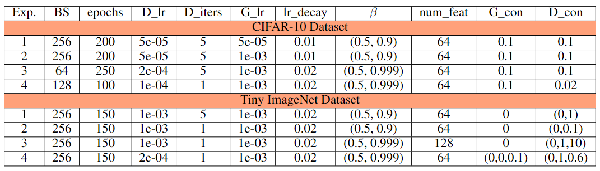

# Improving Latent Space of GANs

[Abdulla Jasem Ahmed Jaber Almansoori](https://github.com/zeligism/), [Talal Abdullah Fadhl Algumaei](https://github.com/Talal-Algumaei), [Muhammad Hamza Sharif](https://github.com/Sharifmhamza/)

[](https://arxiv.org/abs/2006.08218)
[](https://arxiv.org/abs/1312.6114)
[](https://paperswithcode.com/paper/generative-adversarial-networks)
[](https://paperswithcode.com/method/infogan)
[](https://paperswithcode.com/paper/exploring-simple-siamese-representation)

## Introduction
The repository contains the implementation of "Improving Latent Space of GANs". In this project, we are combining three learning paradigms: generative learning,
contrastive learning, and generative-contrastive learning. Our main objective is to train GAN to learn disentangled representations. For that purpose, we proposed two frameworks.
### Proposed Framework 1:
In the first proposed framework, we combined GANs, SimSam Network and Autoenconder. The architecture of proposed framework is shown as: 


The limitations we faced from this design made us rethink the framework, which led us to the second framework detailed below.

### Proposed Framework 2:
In the second proposed framework, we used an AC-GAN-style training algorithm for conditioning the generator on the representations from SimSiam. The model design is as follows:


The second framework performs more closely to our expectations, so we ran most of our experiments using it.

## Dependencies
* Ubuntu based machine with NVIDIA GPU or Google Colab is recommended for running the training and evaluation script.
* Python 3.8.
* Pytorch 1.10.0 and corresponding torchvision version.

## Installation
We recommend creating a conda environment when not using Google Colab. The installation steps are as follows:
```bash
$ conda create -n ConGAN python=3.8
$ conda activate ConGAN
$ pip install -r requirements.txt
```

## Training the Model from Scratch
Steps for training the model from scratch:
1. Download the desired pretrained SimSiam model from this [link](https://github.com/facebookresearch/simsiam).
2. Specify the path to the pretrained model and the main directory in the "Header/Imports" section.
3. Run the cells until "Training/Args" section.
4. Specify the arguments and hyperparameters for your experiment.
5. Run the cells until "Training/Run".
6. Define your training run. For example, you can save the model every 5 epochs, or you might want to increase some hyperparameter linearly every epoch.
7. Run the experiment for the desired number of epochs.
8. Check generator's performance for a variety of representation sampling methods in the "Training/Results" section.
9. Evaluate the performance of the generator by running the cells in the "GAN Metrics" section.

## Path to Pretrained Models
We provide links to download the model components for two experiment runs:
1. We set the consistency coefficients initially set to 0, then 0.1 after 30 epochs, then 1.0 after 30 epochs, and then trained for 30 epochs more (total 90 epochs).
2. Consistency coefficients set to 0 and the generator is not conditioned on the representation. In other words, we train the same architecture using without conditioning.

We report the results and links for downloading the model components in the following table:

| Run | IS   | FID   | model.pth.tar  | latent_transform.pth.tar | Q.pth.tar  |
| --- | ---- | ----- | -------------- | ------------------------ | ---------- |
| 1   | 5.86 | 67.74 | [link][model1] | [link][lt1]              | [link][q1] |
| 2   | 5.44 | 72.23 | [link][model2] | [link][lt2]              | [link][q2] |

[model1]: https://drive.google.com/file/d/1FUyZ3dotgrsR9Lr_dKqU9hOn1mU7Gntr/view?usp=sharing
[lt1]: https://drive.google.com/file/d/1TTH0S8s-cqJsQDaQIh27VfK9FsI78gP5/view?usp=sharing
[q1]: https://drive.google.com/file/d/1WHKjDVeNORxKwdEay_0gg6NPjF6wra4B/view?usp=sharing
[model2]: https://drive.google.com/file/d/1k_ftsFRsCUaOcVhi2y6TOlZAnQ118MDG/view?usp=sharing
[lt2]: https://drive.google.com/file/d/15OTGryu3EzMQPCVziuqS6yOmHgzEBBRu/view?usp=sharing
[q2]: https://drive.google.com/file/d/1Vvy9gR6l7ySs4xxgwti66A9G7znz7_fv/view?usp=sharing


### Experimental Settings
All the experiments are performed on CIFAR-10 and tiny imagenet datasets with the different parameter settings.

### Qualitative Results


## Contact
Should you have any question, please contact at Abdulla.Almansoori@mbzuai.ac.ae, Talal.Algumaei@mbzuai.ac.ae, Muhammad.Sharif@mbzuai.ac.ae

